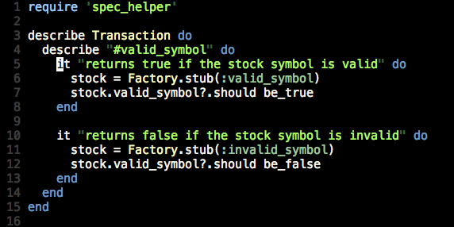

!SLIDE bullets incremental

# What is VCR? #

* Gem that helps simplify your tests

* Test interaction with outside APIs

* Records web requests and responses

!SLIDE center

!SLIDE commandline

# Installation #

  $ gem install vcr

  $ gem install fakeweb

  or

  $ gem install webmock

!SLIDE bullets

# What's next? #

* Setup your VCR

* Use a cassette

!SLIDE center

# Simple setup #
(in vcr_setup.rb)

!SLIDE center

# Other setup #

!SLIDE bullets incremental

# Recording modes #

* Once

* New episodes

* None

* All

!SLIDE bullets

# Once #

* Replay previously recorded interactions

* Record new interactions if no cassette

* Errors on new requests if cassette exists

!SLIDE bullets

# New episodes #

* Records new interactions

* Replays previously recorded interactions

* uses :match\_requests\_on

!SLIDE bullets

# None #

* Replays previous interactions

* Errors on new requests

* Useful if code makes dangerous http requests

!SLIDE bullets

# All #

* Records all new interactions

* Never replays previously recorded interactions

* Re-record a cassette, or log HTTP requests

!SLIDE center

# filter\_sensitive\_data #

!SLIDE center

# Pre VCR tests #

!SLIDE center

# Macro magic! #

!SLIDE center

# Tagged test #

!SLIDE

# Generates new cassette #

spec/fixtures/vcr_cassettes/Transaction/\_valid\_symbol.yml

!SLIDE bullets incremental

# How are requests matched? #

* Defaults to URI and HTTP method

* Can also use :host or :path

* :body and :headers too, but no FakeWeb support

!SLIDE center

# :match\_requests\_on #

!SLIDE

# Quick Demo #

!SLIDE bullets

# One more thing #

* Stay up to date

* remember to update your cassettes!

!SLIDE center

# re\_record\_interval #

